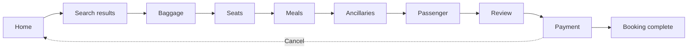
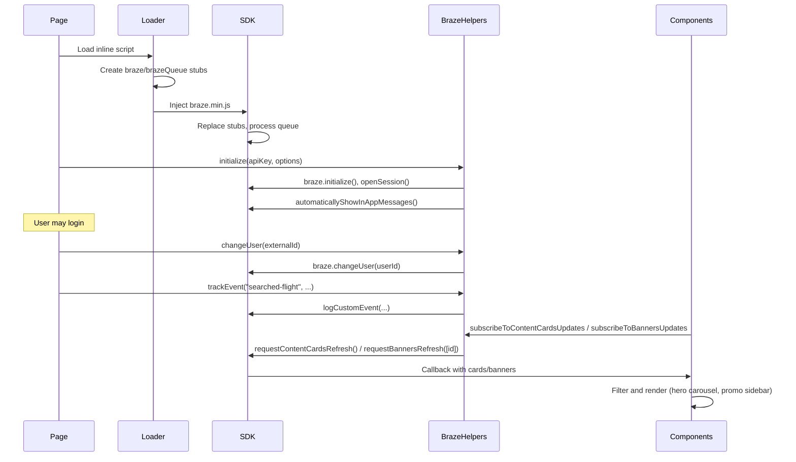

# Website functionality documentation

This document describes the Wego Workshop app: overall user flow, Braze SDK process flows, and personalized/dynamic components.

---

## 1. Overall user flow in the app

### Entry points

- **home.html** — Main entry point. Users land here to search for flights and use the hero carousel and promo feed.
- **braze-helpers-test.html** — Dev/test page for BrazeHelpers unit tests; not part of the main user flow.

### Primary flow

**Home → Search results → Booking funnel (7 steps) → Payment → Booking complete**

### Step-by-step flow

1. **Home** (`home.html`)
   - Flight search form: origin, destination, depart/return dates, class, passengers.
   - Submit → **search_results.html**.
   - Promo feed “Learn more” links can deep-link to search with route params (`?from=...&to=...`).

2. **Search results** (`search_results.html`)
   - Filters (airline, depart/arrival), sort (price/duration), list of flights.
   - “BUY” on a flight → **booking-baggage.html** (booking state set in JS before navigation).

3. **Booking funnel** (linear steps with optional jump via step nav)
   - **Baggage** → **Seats** → **Meals** → **Ancillaries** → **Passenger** → **Review** → **Payment**.
   - Each step has “Previous step” / “Next step”.
   - **booking-steps** component allows jumping to any step.
   - **Review** (`booking-review.html`) has “Change” links back to baggage, seats, meals, ancillaries, passenger; “Next step” goes to payment.

4. **Payment** (`booking-payment.html`)
   - Submit → **booking-complete.html**.
   - Cancel → **home.html**.

5. **Booking complete** (`booking-complete.html`)
   - Confirmation: booking code, add to calendar, download app, subscribe.

### Global navigation

- **Header** (`components/header.html`) is included on all main app pages.
- Logo and “Reset” → **home.html**.
- Notifications (bell icon) and Braze panel (“Braze” link) are available app-wide.

### Component inclusion

Pages load shared UI via `data-include="components/..."`. The script `js/components/include.js` fetches and injects the HTML.

| Page | Header | Hero carousel | Promo feed | Booking steps | Promo sidebar |
|------|--------|---------------|------------|---------------|----------------|
| home.html | ✓ | ✓ | ✓ | — | — |
| search_results.html | ✓ | — | — | — | — |
| booking-baggage.html | ✓ | — | — | ✓ | ✓ |
| booking-seats.html | ✓ | — | — | ✓ | ✓ |
| booking-meals.html | ✓ | — | — | ✓ | ✓ |
| booking-ancillaries.html | ✓ | — | — | ✓ | ✓ |
| booking-passenger.html | ✓ | — | — | ✓ | ✓ |
| booking-review.html | ✓ | — | — | ✓ | ✓ |
| booking-payment.html | ✓ | — | — | ✓ | ✓ |
| booking-complete.html | ✓ | — | — | — | ✓ |
| braze-helpers-test.html | — | — | — | — | — |

---

## 2. Braze SDK process flows

### SDK load

Each page includes an inline loader that:

1. Creates `window.braze` and `window.brazeQueue` with stub methods so calls can be queued before the script loads.
2. Injects `<script src="https://js.appboycdn.com/web-sdk/6.5/braze.min.js" async>`.
3. When the real SDK loads, it replaces the stubs and processes the queue.

### Initialization

- **Order:** Braze Web SDK script → `js/braze.js` (BrazeHelpers) → `js/brazesdk.js`.
- **js/brazesdk.js** calls `BrazeHelpers.initialize(apiKey, options)` with `BRAZE_SDK_CONFIG`.
- **js/braze.js** `initialize()`: calls `braze.initialize(apiKey, opts)`, then (unless disabled) `braze.automaticallyShowInAppMessages()`, then `initUserSession()` (e.g. `braze.openSession()`).
- **Config** (in `js/brazesdk.js`): `apiKey`, `options.baseUrl` (e.g. `sdk.iad-03.braze.com`), `enableLogging`, `allowUserSuppliedJavascript`, `automaticallyShowInAppMessages`.

### User identification

- **Anonymous:** Default. SDK tracks by device/anonymous id.
- **Logged-in:** When the user clicks “Login”, `js/auth-demo.js` calls `braze.changeUser(DEMO_USER.externalId)` (e.g. `wego9999`) and stores the user in localStorage. `getCurrentUser()` is used by the Braze panel.

### Events

| Event | When | Properties |
|-------|------|------------|
| **searched-flight** | Home page flight search form submit (`home.html`) | `origin`, `destination`, `depart`, `return`, `class`, `passengers` |
| **booked-flight** | Booking payment form submit (`booking-payment.html`) | `origin`, `destination`, `bookingCode` |

- Implemented via `BrazeHelpers.trackEvent(eventName, properties)` → `braze.logCustomEvent(eventName, properties)`.
- If the SDK is not ready, events are stored locally in BrazeHelpers (e.g. up to 10) and flushed when the SDK loads.

### Content Cards (hero carousel)

1. Hero carousel init in `js/components/hero-carousel.js` calls `BrazeHelpers.subscribeToContentCardsUpdates(callback)`.
2. `BrazeHelpers.getBraze().requestContentCardsRefresh()` fetches from Braze.
3. Callback receives payload; cards are filtered by `card.extras["message_type"] === 'hero_carousel'`.
4. Each card is turned into a slide (image, title, description, url, linkText).

### Banners (promo sidebar)

1. Promo sidebar in `js/components/promo-sidebar.js` calls `BrazeHelpers.subscribeToBannersUpdates(callback)`.
2. `BrazeHelpers.getBraze().requestBannersRefresh(['ux_promo_sidebar'])` with container id `ux_promo_sidebar`.
3. In the callback, `sdk.getBanner('ux_promo_sidebar')` and `sdk.insertBanner(banner, container)` render the banner in the sidebar.

### In-app messages

- Handled by the SDK. `automaticallyShowInAppMessages: true` in config and `braze.automaticallyShowInAppMessages()` is called in `BrazeHelpers.initialize()`.
- In-app messages are shown automatically when triggered; there is no custom display logic in the app.

### Braze panel (debug)

- Opened from header link `#ux_braze`.
- Shows User Profile, Attributes, and Events from localStorage and `getCurrentUser()` (local mirror of Braze state, not live Braze API).
- Implemented in `js/components/braze-panel.js`.

### Braze flow overview

---

## 3. Personalized components in the app

Each component is documented with purpose, where it is used, data source, main files, and key APIs/behavior.

### Summary table

| Component | Purpose | Where used | Data source | Main files |
|-----------|--------|------------|-------------|------------|
| **Hero carousel** | Slides with image, title, description, CTA; prev/next | home.html only | localStorage `wego_hero_carousel`, fallback DEMO_SLIDES, Braze Content Cards (`message_type === 'hero_carousel'`) | `components/hero-carousel.html`, `js/components/hero-carousel.js`, `css/common.css` |
| **Promo feed** | Grid of promo blocks (image, title, description, “Learn more”) | home.html only | Static HTML; replaceable by id via `PromoFeed.replacePromo(id, options)` (no Braze in code) | `components/promo-feed.html`, `js/components/promo-feed.js` |
| **Promo sidebar** | Aside for Braze-driven promo content | All booking pages + booking-complete.html | Braze Banners, container id `ux_promo_sidebar` | `components/promo-sidebar.html`, `js/components/promo-sidebar.js` |
| **Notifications** | Header bell; slide-out list; dismiss; count badge | All pages that include header | localStorage `wego_notifications`; demo reset on first load; booking-complete adds confirmation message | `components/header.html`, `js/components/notifications.js` |
| **Braze panel** | Debug overlay: User profile, Attributes, Events | All pages with header | localStorage + `getCurrentUser()` (local mirror) | `components/header.html`, `js/components/braze-panel.js` |
| **Booking steps** | Step nav for booking; highlights current step from URL | All booking step pages (baggage through payment), not complete | URL pathname + fixed step mapping in JS | `components/booking-steps.html`, `js/components/booking-steps.js` |

### Hero carousel

- **Purpose:** Renders slides (background image, title, text, CTA). Prev/next buttons; can be driven by Braze Content Cards.
- **Where used:** home.html only (`#ux_hero_carousel`, `data-include="components/hero-carousel.html"`).
- **Data source:** localStorage key `wego_hero_carousel`; in-code fallback `DEMO_SLIDES`; Braze Content Cards with `extras["message_type"] === 'hero_carousel'` (each card adds a slide via `addItem()`).
- **Key APIs:** `HeroCarousel.addItem(item)`, `HeroCarousel.reset()`, `HeroCarousel.getSlides()`. Reset can be triggered via sessionStorage flag `wego_hero_carousel_reset` (e.g. global Reset).

### Promo feed

- **Purpose:** Grid of promo blocks (image, title, description, “Learn more” link). Content of blocks can be replaced by id.
- **Where used:** home.html only (`#ux_promo_feed`, `data-include="components/promo-feed.html"`).
- **Data source:** Static HTML in `components/promo-feed.html`. Any caller can use `PromoFeed.replacePromo(id, { title, description, link, imageUrl })`; no Braze or remote source in code.
- **Key details:** Block ids `ux_promo_feed_0`–`ux_promo_feed_3` (or numeric 0–3). “Learn more” links go to search_results.html with query params (e.g. `?from=KUL&to=SIN`).

### Promo sidebar

- **Purpose:** Aside placeholder; Braze injects banner content into it.
- **Where used:** booking-baggage.html, booking-seats.html, booking-meals.html, booking-ancillaries.html, booking-passenger.html, booking-review.html, booking-payment.html, booking-complete.html (`#ux_promo_sidebar`, `data-include="components/promo-sidebar.html"`).
- **Data source:** Braze Banners. `BrazeHelpers.subscribeToBannersUpdates(callback)`; in callback, `sdk.getBanner('ux_promo_sidebar')` then `sdk.insertBanner(banner, container)`. `requestBannersRefresh(['ux_promo_sidebar'])` on load.
- **Key details:** Container id `CONTAINER_ID = 'ux_promo_sidebar'` must match Braze banner placement. Optional `PromoSidebar.update({ imageUrl, title, description })` for manual fallback.

### Notifications

- **Purpose:** Header bell icon; click opens overlay with list of messages; dismiss per item; count badge.
- **Where used:** All pages that include the header (home, search_results, all booking pages). Trigger and overlay live in `components/header.html` (`#ux_notifications`, `#ux_notifications_overlay`).
- **Data source:** localStorage key `wego_notifications`. Demo messages on first load (session) via `reset()` and init flag in sessionStorage. booking-complete.html adds one message: `Notifications.addMessage('Your flight to … is confirmed. Booking code: …')`.
- **Key APIs:** `Notifications.addMessage(text)`, `removeMessage(id)`, `reset()`, open, close, `updateCount`, `renderList`. Click `#ux_notifications` toggles overlay; Escape closes; dismiss button removes item and updates storage.

### Braze panel

- **Purpose:** Left overlay showing User Profile, Attributes, and Events (debug UI for Braze state).
- **Where used:** Same as header (home, search_results, all booking pages). Markup in `components/header.html` (`#ux_braze`, `#braze-panel-overlay`, `#braze-panel`).
- **Data source:** localStorage keys `wego_braze_profile`, `wego_braze_attributes`, `wego_braze_events`. Profile can come from `window.getCurrentUser()` (e.g. auth-demo). Not live from Braze API; local mirror.
- **Key APIs:** `BrazePanel.updateProfile()`, `updateAttributes()`, `addEvent()`, open, close, render. Click `#ux_braze` toggles; Escape or backdrop closes.

### Booking steps

- **Purpose:** Navigation of step links; highlights current step based on URL.
- **Where used:** booking-baggage.html through booking-payment.html (not home, search_results, or booking-complete). `#ux_booking_steps`, `data-include="components/booking-steps.html"`.
- **Data source:** URL pathname and fixed mapping in JS (e.g. `pageById`: `step-baggage` → `booking-baggage.html`). No Braze.
- **Key details:** Dispatches `booking-steps-ready` when links are set; some booking pages listen to update step links.

### Supporting data (not a component)

**js/data.js** provides mock data for the travel booking demo: `TRAVEL_CITIES`, `AIRLINES`, `FLIGHT_CLASSES`, `BAGGAGE_OPTIONS`, `MEAL_OPTIONS`, etc. These feed dropdowns and options on the search and booking pages and are not personalized components.
